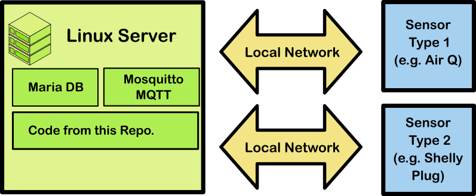
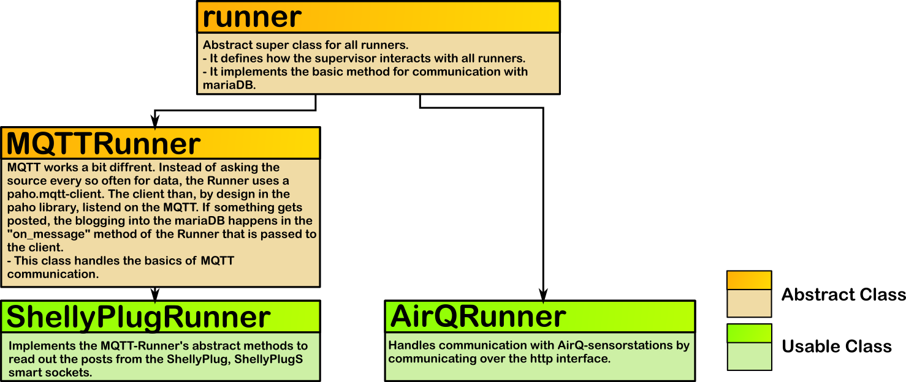

This is a program that is ment to run a sensor network with the following(ish) topology:

## Intorduction
The idea here is relatively simple. The program at hand is ment to be run on the server in a sensor network to cover gather the information that is available in diffrent spots in the network and save them in the SQL database. The program consists of one supervisor script (Supervisor.py). The supervisor takes one flag, that should contain a path that points to the SensorNetworkConfig.json file, that has the informations on the sensor network that should be ran (where are which rescources). 
It than creates one Runner instance for every resource. Runners are programms that each have their own sub process and are attached to one data source. If there are e.g. 2 AirQ sensorstations and 6 Shelly Plugs, there is one supervisor process and 8 runners. 2 for the individual airQs and 6 for the individual shellys. 
The Runners basically capture or request data and store it in the database. In the case of the shelly plug, the runner listens to the MQTT topics of its shelly plug and, upon arriving messages, stores the data in the SQL database. 
The AirQ-Runner works a little bit different. The AirQ provides data on a http-server. The runner requests that data every n seconds and stores it.
Runners inheret from the global runner class, that contains coder to unify the way, informations are passed trough the runners in the config.json and the interaction with the sql.

## Config.json and general Runner interface.

The config.json has multiple areals. One is the general field. General information on the sensor net, like address, port and database name of the database are contained here.
Per kind of runner that is used, a nother area has to be defined. The name of this area is runner specific. e.g. AirQ for the airQ-runners.
In this areal are different subsections. One per runner. The name of the runner section is the name of the table that will be used to store data from that runner. If there is an areal named AirQ1 in the AirQ areal, there will be an AirQ1 table in teh db. Further, the field must contain the information that is needet to access the rescouce. In the case of the shelly plug these infos are the name of the shelly plug to identify the MQTT topic.
The handling of these informations is automatically done by the runner.py parent class. The child classes just have to implement specific parts and get specific informations passed directly.

## Running the Sensor Network

## Different Runner instances

### AirQ Runner

### Shelly Plug Runner

## Setting up the Network.

This section contains a step by step guide to setup an instance of the sensornetwork containing one server and one or more AirQ Sciences and one or more Shelly-Plugs.
In this network, the server is running an mqtt server and a MariaDB instance. Both are configured to be accessible from all locations. Restrictions are coordinated by the firewall on the server,
which, in this guide is configured using ufw. 
In this configuration, IP-Addresses are assigned statically by the router.
In this Example, we use a raspberry pi 400 as server.
The guide contains the following sections:

* Step 1: Configuration of the Router
* Step 2: Installing an OS on the server
* Step 3: Installing and configuring ufw
* Step 4: Installing and testing MariaDB
* Step 5: Installing and testing MQTT
* Step 6: Integration and Configuration of the Shelly Plugs
* Step 7: Integration and Configuration of the Air Q Science.
* Step 8: Deploying the code in this repo.
* Step 9 (Optional): Installing a graphic DB-Browser

### Step 1: Configuration of the Router

### Step 2: Installing an OS on the server

### Step 3: Installing and configuring ufw

### Step 4: Installing and testing MariaDB

### Step 5: Installing and testing MQTT

### Step 6: Integration and Configuration of the Shelly Plugs

### Step 7: Integration and Configuration of the Air Q Science.

### Step 8: Deploying the code in this repo.

### Step 9 (Optional): Installing a graphic DB-Browser
